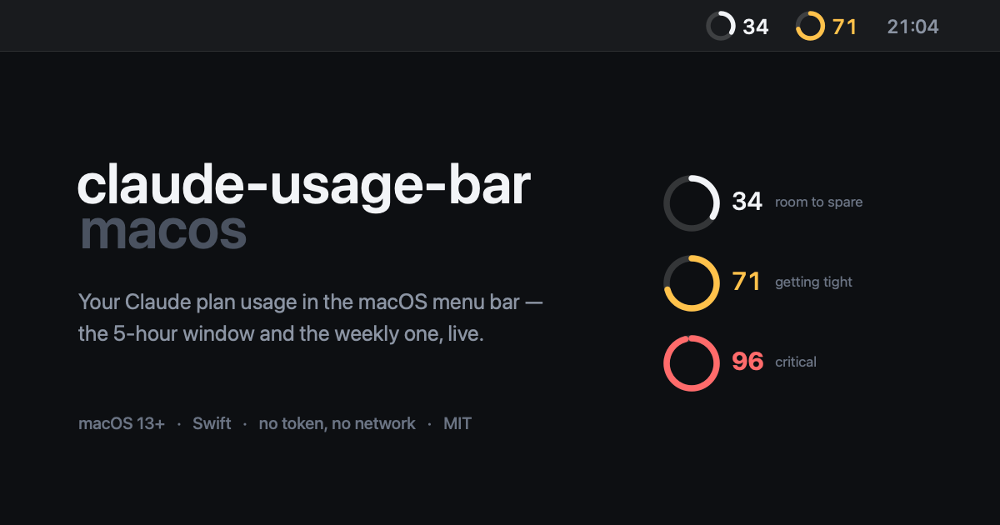

<p align="center">
  
</p>

# claude-usage-bar-macos

**Your Claude plan usage in the macOS menu bar — the 5-hour window and the weekly one, live, without opening anything.**

[](#install)
[](Package.swift)
[](#install)
[](#where-the-number-comes-from)
[](#where-the-number-comes-from)
[](LICENSE)

A menu bar agent that reads the usage file Claude Desktop already writes, and draws it where you can see it without clicking anything. No API token, no network calls, no scraping.

**Contents** — [Why this exists](#why-this-exists) · [Where the number comes from](#where-the-number-comes-from) · [Install](#install) · [The menu](#the-menu) · [Tuning with defaults](#tuning-with-defaults) · [Multiple profiles](#multiple-profiles-optional) · [Inspecting it](#inspecting-it-without-a-screenshot) · [Layout](#layout)

## Why this exists

Claude Desktop shows plan usage only when you go looking for it, and its UI cannot be extended: the `app.asar` hash is pinned in `Info.plist`, the bundle is sealed under the hardened runtime, and the app detects `--remote-debugging-port` in a blocklist of switches. Nothing gets injected into that app.

Claude Code's `statusLine` is no help either: **the Code tab of the desktop app never executes it** — only the terminal TUI does. If you live in the app, the status line is invisible to you.

What is left is reading the file the app already writes, from outside.

## Where the number comes from

`<profile>/plan-usage-history.json`, written by Claude Desktop itself roughly every 15 minutes:

```json
{"version":2,"samples":[{"t":1788110635759,"org":"…","u":{"fh":38,"sd":40}}]}
```

`u.fh` is the 5-hour window, `u.sd` the 7-day one, both percentages 0–100. There is no reset time in the file, only the percentage. Roughly 30 days of samples are kept.

> [!IMPORTANT]
> **This file is not a documented API.** A Claude Desktop update could rename or drop it, and then the bar goes quiet. It degrades honestly — no sample, no number — but do not build anything load-bearing on it.

A sample older than 45 minutes is not shown at all. A stale file means the app has been closed, and a window may have reset since; the last number would be a lie rather than old news.

## Install

Requires macOS 13+ and a Swift toolchain (Xcode or the Command Line Tools).

```bash
git clone https://github.com/LucasHenriqueDiniz/claude-usage-bar-macos
cd claude-usage-bar-macos
make install
```

That builds, drops `~/Applications/Claude Usage Bar.app`, and registers a LaunchAgent so it returns at login.

| command | what it does |
|---|---|
| `make install` | build, bundle, register the agent |
| `make uninstall` | remove the agent and the bundle, keep preferences |
| `make run` | run in the foreground, for hacking on it |
| `make build` | compile only |

## The menu

Everything is configurable from the menu itself — there is no preferences window to open.

| menu | options |
|---|---|
| **5-hour window** | show on the bar, and one of seven shapes |
| **Weekly window (7d)** | the same, independently |
| **Appearance → colour** | colour by level · monochrome |
| **Appearance → colour steps** | early warning (40·60·80) · standard (60·80·95) · relaxed (70·85·95) · custom |
| **Appearance → when Claude is closed** | show a dash · hide the item |
| **Appearance → profile badge** | nothing · hexagon · dot · hexagon + name · name only |

The seven shapes are ring + number, ring, bar + number, bar, number, number with %, and label + number. **Each one is drawn as a preview next to its menu item**, at a sample level and under your current thresholds — a menu that names seven shapes in words is a menu you have to try one at a time.

A few defaults worth knowing, and why they are what they are:

- **The weekly window starts hidden.** It moves slowly and is rarely what runs out first. Turn it on and it comes in compact, because a second number on the bar doubles the digit count.
- **The profile badge starts hidden**, and its submenu only appears once `profilesDirectory` is set. With one profile a badge would always say the same thing.
- **Monochrome keeps the warning.** It drops the tones but the **weight** still changes at the critical step — the signal that reaches a colour-blind reader in either scheme.
- **Hiding the item when Claude is closed** also hides the menu that undoes it. It comes back the moment Claude opens, and the submenu says so before you click.

## Tuning with defaults

Exact colour steps make a poor menu, so the menu offers three shapes of the same curve and leaves the fourth to `defaults`. Pick **Custom** in the menu and these take over:

```bash
defaults write dev.claude-usage-bar.menubar attentionThreshold -int 55
defaults write dev.claude-usage-bar.menubar tightThreshold     -int 75
defaults write dev.claude-usage-bar.menubar criticalThreshold  -int 90
```

Below the first threshold the number stays the ordinary text colour and warms up from there.

To reset everything: `defaults delete dev.claude-usage-bar.menubar`.

## Multiple profiles (optional)

If you run Claude with `--user-data-dir` to keep separate accounts, point the bar at the directory holding them and give it a command that switches. The profile name is appended as the last argument.

```bash
defaults write dev.claude-usage-bar.menubar profilesDirectory ~/.claude-profiles
defaults write dev.claude-usage-bar.menubar switchCommand -array ~/bin/claude-profile open
```

The bar then names the open profile, tints it, and offers the others in the menu. Leave both unset — the stock setup — and it just tracks the default profile at `~/Library/Application Support/Claude`.

Each profile gets its colour from a stable hash of its name, so adding one needs no code change.

## Inspecting it without a screenshot

The button draws its own text, so it has no accessibility *title* — but it does set a label:

```bash
osascript -e 'tell application "System Events" to tell process "ClaudeUsageBar" \
  to get description of menu bar item 1 of menu bar 1'
# → 5h 7%, 7d 53%
```

You can click menu items from there too, which is how you test the preferences for real.

## Layout

| file | responsibility |
|---|---|
| `Paths.swift` | where things live, and `run()` for talking to `ps` |
| `Profile.swift` | which profile is open, from the process's `--user-data-dir` |
| `Usage.swift` | last percentage, from `plan-usage-history.json` |
| `Preferences.swift` | the choices, in `UserDefaults` |
| `Colors.swift` | tones that work on both a light and a dark bar |
| `Rendering.swift` | preferences → image, and the menu previews |
| `main.swift` | `NSStatusItem`, the menu, and the 3 s timer |

Everything on the button is drawn, text included: the parts interleave (badge, ring, number, ring, number) and `image + attributedTitle` only manages "graphic first, text after". The menu bar follows the wallpaper rather than the system theme, so every colour resolves at draw time and the image is never cached.

`.github/banner.swift` regenerates the banner with the same ring geometry the bar uses, so it cannot promise a look the product does not have.

## License

MIT — see [LICENSE](LICENSE).
